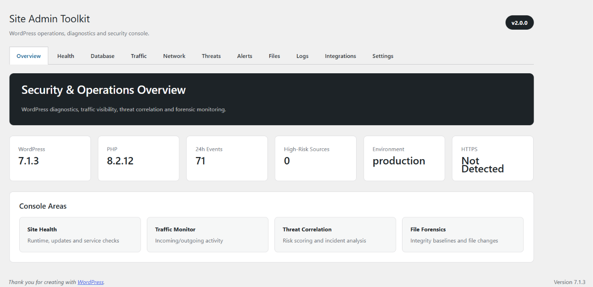
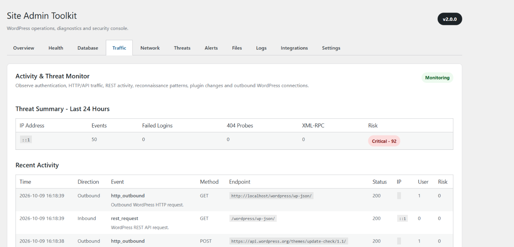
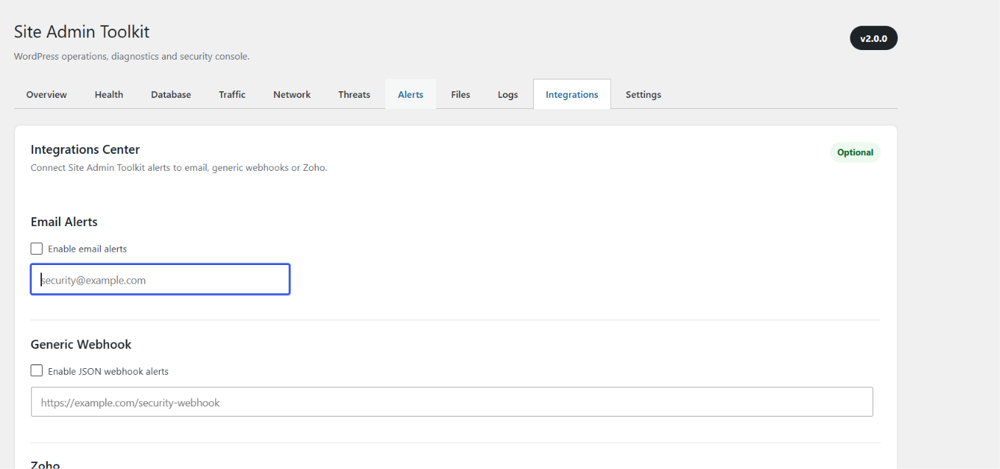

# Site Admin Toolkit

**WordPress Security, Operations, Threat Monitoring & Forensics Console**

Site Admin Toolkit is a modular WordPress administration and defensive-security plugin that provides centralized visibility into site health, database behavior, application traffic, threat indicators, file integrity, diagnostics, and external alert integrations.

**Current Release: v2.0.0**

---

## Overview

Site Admin Toolkit began as a lightweight administration utility and evolved into a full WordPress security and operations console.

The project is built around several principles:

- Read-only monitoring first
- Defensive security
- Safe administrative controls
- Modular PHP architecture
- Minimal sensitive-data collection
- Configurable threat thresholds
- Optional external integrations
- Human review before destructive action

The toolkit does not automatically label users as attackers. Instead, it collects technical indicators, correlates behavior, calculates risk, and provides administrators with evidence that can support investigation.

---

## Security Console

The administration interface is organized into dedicated tabs:

```text
Overview
Health
Database
Traffic
Network
Threats
Alerts
Files
Logs
Integrations
Settings
```

---

## Screenshots

### Security Overview



### Site Health & Updates


### Threat Monitoring



### Error Log & Diagnostics


### Integrations Center



---

## Features

### Overview

The main dashboard provides a quick view of WordPress version, PHP version, environment type, HTTPS status, recent activity, high-risk sources, and available security/operations modules.

### Site Health Monitoring

Monitor WordPress core, plugin and theme updates, PHP version, HTTPS, WP_DEBUG, WP-Cron, REST API, memory limits, upload limits, active theme, database version, and site URLs.

### Backup & Protection Readiness

Evaluate database size, wp-content size, uploads size, writable directories, wp-config.php availability, backup plugin detection, and the WordPress database prefix.

Recognized tools include UpdraftPlus, Duplicator, BackWPup, All-in-One WP Migration, WPvivid, Jetpack, and BackupBuddy.

Backup readiness does not guarantee that a valid or recoverable backup exists.

### Database Health

Inspect database and table sizes, index usage, overhead, storage engine, collation, estimated rows, autoloaded options, autoload memory usage, expired transients, revisions, spam, trash, and the largest WordPress tables.

The database module is read-only and does not automatically delete, optimize, or modify database data.

### Activity Monitor

Site Admin Toolkit records selected WordPress-level activity for security analysis, including successful and failed logins, logouts, user creation, plugin activation/deactivation, REST activity, XML-RPC activity, POST requests, 404 probing, and outbound WordPress HTTP requests.

Recorded events can include timestamp, direction, event type, HTTP method, endpoint, status code, source IP, WordPress user, duration, risk score, and event details.

Sensitive request bodies, passwords, cookies, authorization headers, and API tokens are intentionally not logged.

### Threat Correlation

Raw events are correlated into higher-level behavioral indicators such as failed-login bursts, multi-username credential spraying, 404 reconnaissance, XML-RPC request bursts, high POST activity, high REST API activity, administrative account creation, plugin changes, and suspicious source behavior.

Each correlated source receives a risk score and explanation. Risk classifications are indicators and do not prove malicious intent.

### Network & Request Analytics

Analyze WordPress-level inbound and outbound activity, including top source IP addresses, HTTP request-method distribution, most requested endpoints, top 404 targets, response-code distribution, REST activity, inbound/outbound totals, slow requests, outbound destination inventory, and CSV network report export.

This module analyzes traffic that reaches WordPress/PHP. Requests blocked upstream by a CDN, WAF, firewall, reverse proxy, Apache, or Nginx may not appear.

### Outbound Connection Monitoring

WordPress HTTP connections can be grouped by destination domain. Administrators can establish an outbound baseline and detect previously unseen destinations.

A new outbound destination is an investigation indicator, not automatic proof of compromise.

### Security Alert Engine

The alert engine combines information from failed authentication, threat correlation, reconnaissance, file integrity, and new outbound domains.

Configurable thresholds include failed-login count, 404 reconnaissance count, and critical risk score.

### File Integrity & Forensics

Create a SHA-256 baseline of WordPress files and compare future scans against the known-good state.

Detect new files, modified files, deleted files, hash changes, PHP-like files inside uploads, writable WordPress paths, and filesystem permissions.

File changes may also be caused by legitimate WordPress, plugin, theme, or administrator updates.

### Error Logs & Diagnostics

Inspect WP_DEBUG, WP_DEBUG_LOG, WP_DEBUG_DISPLAY, PHP display_errors, PHP error logs, WordPress debug.log, log size, log modification time, and recent log entries.

The diagnostics module avoids loading entire large log files into memory.

---

## Integrations

All integrations are optional. The plugin operates normally without any external service.

### Email Alerts

Security alerts can be delivered to a configured email address.

### Generic Webhooks

Security events can be sent as JSON to internal monitoring systems, automation platforms, SIEM tools, incident-management systems, and custom APIs.

### Zoho

Zoho support is optional. Available capabilities include Zoho OAuth connection testing, Zoho Flow webhook delivery, and security alert forwarding.

Zoho can be completely disabled on sites that do not use it.

---

## Zoho Credential Security

Zoho secrets are intentionally not stored in normal WordPress options.

Define credentials in `wp-config.php`:

```php
define('SAT_ZOHO_CLIENT_ID', 'your-client-id');
define('SAT_ZOHO_CLIENT_SECRET', 'your-client-secret');
define('SAT_ZOHO_REFRESH_TOKEN', 'your-refresh-token');
```

Do not commit real credentials to Git.

Site Admin Toolkit reports whether the required constants are configured but does not display their values. OAuth access tokens obtained during authentication are temporary and are not persisted by the plugin.

---

## Alert Delivery

Site Admin Toolkit can automatically evaluate current alerts and dispatch them through enabled integrations:

- Email
- Generic JSON Webhook
- Zoho Flow

Duplicate alert fingerprints are temporarily tracked to reduce repeated notifications for unchanged findings.

---

## Architecture

```text
site-admin-toolkit/
|
|-- assets/
|   |-- css/
|   |   `-- admin.css
|   `-- screenshots/
|       |-- security-overview.png
|       |-- site-health.png
|       |-- threat-monitor.png
|       |-- diagnostics.png
|       `-- integrations.png
|
|-- includes/
|   |-- activity-monitor.php
|   |-- admin-page.php
|   |-- alert-engine.php
|   |-- backup-readiness.php
|   |-- database-health.php
|   |-- dashboard-widget.php
|   |-- diagnostics.php
|   |-- file-integrity.php
|   |-- integrations.php
|   |-- maintenance-mode.php
|   |-- network-analytics.php
|   |-- settings.php
|   |-- shortcode.php
|   |-- site-health.php
|   `-- threat-correlation.php
|
|-- README.md
|-- site-admin-toolkit.php
`-- uninstall.php
```

Each major feature is separated into its own module to keep the codebase maintainable and extensible.

---

## Installation

Clone or download the repository and place the plugin directory inside:

```text
wp-content/plugins/site-admin-toolkit
```

Activate it from:

```text
WordPress Admin
-> Plugins
-> Site Admin Toolkit
-> Activate
```

Then open:

```text
WordPress Admin
-> Site Toolkit
```

---

## Requirements

Recommended environment:

```text
WordPress 6.x+
PHP 8.1+
MySQL 8.x or compatible MariaDB
```

Some functionality depends on server configuration and PHP permissions.

---

## Security Model

Site Admin Toolkit is a defensive monitoring tool.

It is designed to observe, record selected events, correlate indicators, calculate risk, detect changes, generate alerts, and support investigation.

It is not designed to exploit vulnerabilities, attack remote systems, automatically block users, automatically delete suspicious files, automatically modify the WordPress database, or guarantee attribution of an attacker.

Administrator review remains part of the incident-response process.

---

## Privacy

Security monitoring may include IP addresses, user IDs, usernames associated with authentication events, requested paths, and event timestamps.

The toolkit intentionally avoids storing passwords, authentication cookies, authorization headers, API keys, OAuth secrets, request bodies, and sensitive query-string values.

Administrators are responsible for configuring retention and use in accordance with applicable privacy requirements.

---

## Important Limitations

Site Admin Toolkit operates primarily at the WordPress/PHP application layer. It cannot automatically see all traffic that is blocked before reaching WordPress.

For complete infrastructure visibility, application monitoring should be combined with Apache/Nginx access logs, web application firewalls, reverse proxies, CDNs, host firewalls, operating-system audit logs, and network monitoring systems.

Server-log ingestion is a possible future expansion of the project.

---

## Shortcode

Site Admin Toolkit includes an announcement shortcode:

```text
[sat_announcement]
```

The announcement text can be configured from the plugin settings.

---

## Maintenance Mode

Administrators can enable maintenance mode from the Site Toolkit settings.

Features include administrator bypass, custom page title, custom maintenance message, HTTP 503 response, Retry-After header, and REST/AJAX/Cron safeguards.

---

## Version History

### 2.0.0
Integrations and alert delivery.

- Optional email alerts
- Generic webhook integration
- Optional Zoho integration
- Zoho OAuth testing
- Zoho Flow support
- Automatic alert dispatch
- Duplicate alert suppression

### 1.9.0
Network analytics and security alert engine.

### 1.8.0
Tabbed security console and SHA-256 file-integrity monitoring.

### 1.7.0
Advanced threat correlation and incident reporting.

### 1.6.0
Activity and threat monitoring foundation.

### 1.5.0
Database health and safe maintenance analysis.

### 1.4.0
Backup and protection readiness.

### 1.3.1
Diagnostics display and status improvements.

### 1.3.0
Error log and PHP diagnostics.

### 1.2.0
Site health and update monitoring.

### 1.1.0
Maintenance mode.

### 1.0.0
Initial Site Admin Toolkit release.

---

## Roadmap

Future development may include:

- Apache/Nginx access-log ingestion
- Security event timeline
- Trusted reverse-proxy configuration
- Extended REST/API analytics
- File-change history
- Alert history and acknowledgement
- Additional SIEM integrations
- Additional CRM/helpdesk integrations
- Scheduled security reports
- Role-based toolkit permissions

---

## Development Philosophy

Site Admin Toolkit favors visibility over destructive automation.

The goal is to provide administrators with enough technical detail to understand what is happening inside a WordPress environment while keeping potentially destructive actions under human control.

---

## Author

**William Murphy**

GitHub: https://github.com/CraftEarth

LinkedIn: https://www.linkedin.com/in/william-murphy-ab262477/

---

## Premium Framework

Version 2.1 introduces the extensible Site Admin Toolkit Premium foundation.

The architecture includes:

- Central feature registry
- Free/Premium feature gates
- Entitlement management
- License activation client
- Coupon redemption client
- Installation identity
- API-ready licensing layer
- Local developer Premium mode

Future modules should use:

```php
sat_feature_enabled('feature_name')
```

Premium coupon creation is intentionally controlled by the private
licensing server rather than individual customer WordPress installations.

For local development only, Premium features can be unlocked in
`wp-config.php`:

```php
define('SAT_LICENSE_DEV_MODE', true);
```

When the private licensing server is deployed, its base URL can be set with:

```php
define('SAT_LICENSE_API_URL', 'https://licenses.example.com/');
```

Do not use development mode on customer production installations.
