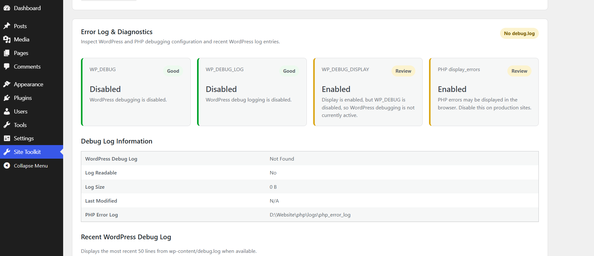
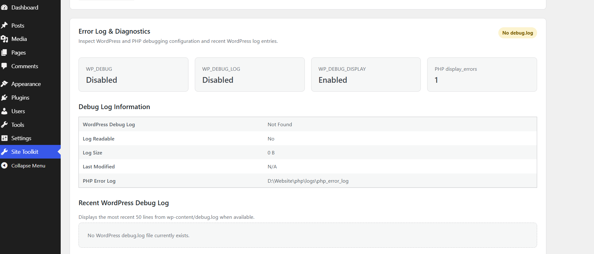

# Site Admin Toolkit

**WordPress Security, Administration, Monitoring & Diagnostics**

Site Admin Toolkit is a modular WordPress administration and defensive-security plugin for site owners, developers, agencies, and support teams.

It brings site health, diagnostics, activity monitoring, threat correlation, file integrity, network visibility, alerting, integrations, Premium entitlement management, and self-hosted updates into one WordPress admin console.

**Current Release: v2.2.3**

---

## Highlights

- Central WordPress administration dashboard
- Site health and update monitoring
- Database health and read-only inspection
- Error-log and diagnostics viewer
- Maintenance mode
- WordPress activity monitoring
- Behavioral threat correlation and risk scoring
- Network and request analytics
- Outbound connection monitoring
- SHA-256 file integrity baselines
- Security alerts and configurable thresholds
- Email, webhook, and optional Zoho integrations
- Free / Premium feature framework
- Remote license activation and coupon redemption
- Premium entitlement lifecycle and feature gating
- Self-hosted WordPress plugin updates
- Clean uninstall and defensive data handling

---

## Screenshots

### Site Health & Updates



### Error Log & Diagnostics



---

## Security Console

The administration interface is organized into dedicated operational and security views for:

- Overview
- Health
- Database
- Traffic
- Threats
- Alerts
- Files
- Logs
- Premium
- Integrations
- Settings

Site Admin Toolkit is designed around a defensive-security model:

- Read-only monitoring first
- Human review before destructive action
- WordPress capability checks
- Nonce protection for administrative actions
- Input sanitization and output escaping
- Minimal sensitive-data collection
- Explicit trust boundaries for proxy headers
- Premium feature checks through a centralized entitlement layer

Threat classifications are behavioral indicators and should not be treated as definitive attribution of malicious intent.

---

## Core Features

### Site Health Monitoring

Monitor common WordPress operational conditions including:

- WordPress core update status
- Plugin update count
- Theme update count
- PHP version
- HTTPS status
- WordPress debug configuration
- WP-Cron configuration
- REST API availability
- Database version
- Active theme
- PHP memory limit
- Maximum upload size
- Site URL
- Home URL

Checks are classified as:

- Good
- Warning
- Critical

---

### Database Health

Read-only database inspection includes:

- Total WordPress database size
- Table overhead
- Autoloaded option count
- Autoloaded option size
- Post revision count
- Trashed post count
- Spam comment count
- Expired transient count
- Largest WordPress tables
- Storage engines
- Approximate row counts
- Collation information
- Database prefix

The database module does not automatically delete, optimize, or modify WordPress records.

---

### Error Logs & Diagnostics

Inspect:

- `WP_DEBUG`
- `WP_DEBUG_LOG`
- `WP_DEBUG_DISPLAY`
- PHP `display_errors`
- PHP error-log configuration
- WordPress `debug.log`
- Debug log size
- Debug log last modified time
- Debug log readability
- Recent log entries

The log viewer reads from the end of the file rather than loading an entire large log into memory.

---

### Maintenance Mode

Built-in maintenance mode supports:

- Custom maintenance page title
- Custom visitor message
- Optional estimated return message
- Automatic administrator bypass
- HTTP 503 response
- `Retry-After` header
- WordPress AJAX availability
- WordPress cron availability
- REST API availability

Administrators can continue working while logged in.

---

### Activity Monitoring

Selected WordPress-level activity can be recorded for defensive analysis, including:

- Successful logins
- Failed login attempts
- User logouts
- New WordPress users
- Plugin activation
- Plugin deactivation
- REST API activity
- Inbound POST requests
- HTTP 404 reconnaissance
- XML-RPC activity
- Outbound WordPress HTTP/API traffic

Site Admin Toolkit intentionally avoids storing:

- Passwords
- Cookies
- Authorization headers
- API tokens
- Request bodies
- URL query strings

---

### Threat Correlation

Events can be correlated into higher-level behavioral indicators such as:

- Failed-login bursts
- Multi-username credential spraying
- 404 reconnaissance activity
- XML-RPC request bursts
- High POST request volume
- High REST API volume
- Administrative account creation
- Plugin activation/deactivation activity

Risk classifications include:

- Normal
- Suspicious
- High Risk
- Critical

Threat classifications represent behavioral indicators and should not be interpreted as definitive proof of malicious intent.

---

### Network Analytics

WordPress-level request analytics include:

- Top source IP addresses
- HTTP request method distribution
- Most requested endpoints
- Top 404 reconnaissance targets
- HTTP response-code distribution
- REST request totals
- Inbound activity totals
- Outbound activity totals
- Slow request detection
- Outbound destination inventory
- Outbound destination baselining
- New outbound domain detection
- CSV network report export

Traffic blocked upstream by a CDN, WAF, firewall, reverse proxy, Apache, or Nginx may not appear unless server-log ingestion is enabled.

---

### Outbound Connection Monitoring

WordPress HTTP traffic can be grouped by destination domain.

Administrators can:

- View outbound destinations
- Establish a known-good outbound baseline
- Detect previously unseen destinations
- Review outbound failures
- Review last-seen activity

A new outbound destination is an investigation indicator and is not automatic proof of compromise.

---

### File Integrity & Forensics

Administrators can establish a SHA-256 baseline and compare later scans against the known-good state.

The toolkit can identify:

- New files
- Modified files
- Deleted files
- File hash changes
- PHP-like executable files inside uploads
- Important filesystem permissions
- Writable WordPress directories

Premium advanced forensics can retain file-change history for investigation.

Legitimate WordPress, plugin, theme, and administrator updates can also modify files.

---

## Security Alerts

The alert engine can correlate information from:

- Threat correlation
- Failed authentication
- Reconnaissance activity
- File integrity monitoring
- Outbound destination baselines

Administrators can configure alert thresholds for selected conditions.

Premium entitlement gates are used for advanced alert automation and custom rules.

---

## Alerts & Integrations

All external integrations are optional.

Supported capabilities include:

- Email security alerts
- Generic JSON webhook alerts
- Optional Zoho integration
- Zoho OAuth connection testing
- Zoho Flow webhook delivery
- Manual integration testing
- Automatic alert dispatch
- Duplicate alert suppression

Sites that do not use external integrations can leave them disabled without affecting core monitoring and diagnostics.

---

## Zoho Credential Security

Zoho OAuth credentials should be defined outside normal WordPress options.

Example:

```php
define('SAT_ZOHO_CLIENT_ID', 'your-client-id');
define('SAT_ZOHO_CLIENT_SECRET', 'your-client-secret');
define('SAT_ZOHO_REFRESH_TOKEN', 'your-refresh-token');